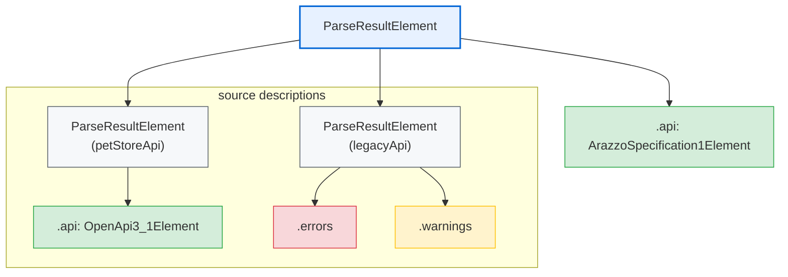

# @jentic/arazzo-parser

`@jentic/arazzo-parser` is a parser for [Arazzo Specification](https://spec.openapis.org/arazzo/latest.html) documents.
It produces [SpecLynx ApiDOM](https://github.com/speclynx/apidom) data model using the [Arazzo 1.x namespace](https://github.com/speclynx/apidom/tree/main/packages/apidom-ns-arazzo-1#readme).

## Installation

You can install this package via [npm](https://npmjs.org/) CLI by running the following command:

```sh
npm install @jentic/arazzo-parser
```

## Usage

`@jentic/arazzo-parser` provides a unified `parse` function that accepts multiple input types:

1. **Plain JavaScript object** - converts to JSON and parses (source maps supported with `strict: false`)
2. **String content** - detects Arazzo content and parses inline JSON or YAML
3. **File system path** - resolves and parses local Arazzo Documents
4. **HTTP(S) URL** - fetches and parses remote Arazzo Documents

### Parsing from object

```js
import { parse } from '@jentic/arazzo-parser';

const arazzoDocument = {
  arazzo: '1.0.1',
  info: {
    title: 'My API Workflow',
    version: '1.0.0',
  },
  sourceDescriptions: [
    {
      name: 'myApi',
      type: 'openapi',
      url: 'https://example.com/openapi.json',
    },
  ],
  workflows: [],
};

const parseResult = await parse(arazzoDocument);
// parseResult is ParseResultElement containing ArazzoSpecification1Element
```

### Parsing from string

```js
import { parse } from '@jentic/arazzo-parser';

// JSON string
const parseResult = await parse('{"arazzo": "1.0.1", "info": {...}}');

// YAML string
const parseResult = await parse(`
arazzo: '1.0.1'
info:
  title: My API Workflow
  version: '1.0.0'
`);
```

### Parsing from file

```js
import { parse } from '@jentic/arazzo-parser';

const parseResult = await parse('/path/to/arazzo.json');
```

### Parsing from URL

```js
import { parse } from '@jentic/arazzo-parser';

const parseResult = await parse('https://example.com/arazzo.yaml');
```

## Parse options

The `parse` function accepts an optional second argument with reference options compatible with [SpecLynx ApiDOM Reference Options](https://github.com/speclynx/apidom/blob/main/packages/apidom-reference/src/options/index.ts):

```js
import { parse } from '@jentic/arazzo-parser';

const parseResult = await parse(source, {
  parse: {
    parserOpts: {
      strict: true,      // Use strict parsing mode (default: true)
      sourceMap: false,  // Include source maps (default: false)
    },
  },
});
```

### Default options

You can import the default options:

```js
import { defaultOptions } from '@jentic/arazzo-parser';

console.log(defaultOptions);
// {
//   parse: {
//     parsers: [...],
//     parserOpts: { sourceMap: false, strict: true, sourceDescriptions: false },
//   },
//   resolve: {
//     resolvers: [...],
//     resolverOpts: {},
//   },
// }
```

## Error handling

When parsing fails, a `ParseError` is thrown. The original error is available via the `cause` property:

```js
import { parse } from '@jentic/arazzo-parser';

try {
  await parse('invalid content');
} catch (error) {
  console.error(error.message);  // 'Failed to parse Arazzo Document'
  console.error(error.cause);    // Original error from underlying parser
}
```

## Working with the result

The `parse` function returns a [ParseResultElement](https://github.com/speclynx/apidom/blob/main/packages/apidom-datamodel/README.md#parseresultelement) representing the result of the parsing operation.

```js
import { parse } from '@jentic/arazzo-parser';

const parseResult = await parse(source);

// Access the main Arazzo specification element
const arazzoSpec = parseResult.api;

// Check if parsing produced any errors
const hasErrors = parseResult.errors.length > 0;

// Check if parseResult is empty
const isEmpty = parseResult.isEmpty;
```

### Retrieval URI metadata

When parsing from a file system path or HTTP(S) URL, the `retrievalURI` metadata is set on the parse result:

```js
import { parse } from '@jentic/arazzo-parser';
import { toValue } from '@speclynx/apidom-core';

const parseResult = await parse('/path/to/arazzo.json');

// Get the URI from which the document was retrieved
const uri = toValue(parseResult.meta.get('retrievalURI'));
// '/path/to/arazzo.json'
```

Note: `retrievalURI` is not set when parsing from inline content (string) or plain objects.

### Source maps

Source maps allow you to track the original position (line, column) of each element in the parsed document. This is useful for error reporting, IDE integrations, linting, and any tooling that needs to show precise locations in the original source.


To enable source maps, set `sourceMap: true` and `strict: false` in the parser options:

```js
import { parse } from '@jentic/arazzo-parser';

const parseResult = await parse('/path/to/arazzo.yaml', {
  parse: {
    parserOpts: {
      sourceMap: true,
      strict: false,
    },
  },
});
```

When source maps are enabled, each element in the parsed result contains positional properties stored directly on the element. Position values use UTF-16 code units for compatibility with Language Server Protocol (LSP) and JavaScript string indexing:

```js
import { parse } from '@jentic/arazzo-parser';

const parseResult = await parse('/path/to/arazzo.yaml', {
  parse: { parserOpts: { sourceMap: true, strict: false } },
});

const arazzoSpec = parseResult.api;

// Access source map properties directly on the element
arazzoSpec.startLine;      // 0-based line number where element begins
arazzoSpec.startCharacter; // 0-based column number where element begins
arazzoSpec.startOffset;    // 0-based character offset from document start
arazzoSpec.endLine;        // 0-based line number where element ends
arazzoSpec.endCharacter;   // 0-based column number where element ends
arazzoSpec.endOffset;      // 0-based character offset where element ends

// Access source map on nested elements
const workflow = arazzoSpec.workflows.get(0);
console.log(`Workflow starts at line ${workflow.startLine}, column ${workflow.startCharacter}`);
```

For more details about source maps, see the [SpecLynx ApiDOM Data Model documentation](https://github.com/speclynx/apidom/tree/main/packages/apidom-datamodel#source-maps).

**Note:** Source maps require `strict: false` to be set. When parsing from objects, they are converted to pretty-printed JSON strings internally (2-space indentation), so source map positions refer to this generated JSON representation, not the original object structure:

```js
// Source maps with objects (requires strict: false)
// Positions will reference the internally generated JSON string
await parse({ arazzo: '1.0.1', ... }, {
  parse: { parserOpts: { sourceMap: true, strict: false } },
});
```

## Parsing source descriptions

Arazzo documents can reference external API specifications (OpenAPI, Arazzo) through [Source Descriptions](https://spec.openapis.org/arazzo/latest.html#source-description-object). The parser can automatically fetch and parse these referenced documents.

**Note:** Source descriptions parsing is disabled by default for performance reasons. Enable it explicitly when you need to resolve and parse referenced API specifications.

### Enabling source descriptions parsing

To parse source descriptions, enable the `sourceDescriptions` option in `parserOpts`:

```js
import { parse } from '@jentic/arazzo-parser';

const parseResult = await parse('/path/to/arazzo.json', {
  parse: {
    parserOpts: {
      sourceDescriptions: true,
    },
  },
});
```

Alternatively, you can configure it per parser for more granular control:

```js
const parseResult = await parse('/path/to/arazzo.json', {
  parse: {
    parserOpts: {
      'arazzo-json-1': { sourceDescriptions: true },
      'arazzo-yaml-1': { sourceDescriptions: true },
    },
  },
});
```

### Selective parsing

You can selectively parse only specific source descriptions by providing an array of names:

```js
const parseResult = await parse('/path/to/arazzo.json', {
  parse: {
    parserOpts: {
      sourceDescriptions: ['petStoreApi', 'paymentApi'],
    },
  },
});
```

### Result structure

When source descriptions are parsed, each parsed document is added to the main `ParseResultElement` as an additional element. The first element is always the main Arazzo document, and subsequent elements are the parsed source descriptions.

Source descriptions are parsed into their appropriate SpecLynx ApiDOM namespace data models based on document type:

- **Arazzo** → [@speclynx/apidom-ns-arazzo-1](https://github.com/speclynx/apidom/tree/main/packages/apidom-ns-arazzo-1)
- **OpenAPI 2.0** → [@speclynx/apidom-ns-openapi-2](https://github.com/speclynx/apidom/tree/main/packages/apidom-ns-openapi-2)
- **OpenAPI 3.0.x** → [@speclynx/apidom-ns-openapi-3-0](https://github.com/speclynx/apidom/tree/main/packages/apidom-ns-openapi-3-0)
- **OpenAPI 3.1.x** → [@speclynx/apidom-ns-openapi-3-1](https://github.com/speclynx/apidom/tree/main/packages/apidom-ns-openapi-3-1)



```js
import { parse } from '@jentic/arazzo-parser';

const parseResult = await parse('/path/to/arazzo.json', {
  parse: {
    parserOpts: {
      sourceDescriptions: true,
    },
  },
});

// Main Arazzo document
const arazzoSpec = parseResult.api;

// Number of elements (1 main + N source descriptions)
console.log(parseResult.length);

// Access parsed source descriptions (filter by 'source-description' class)
for (let i = 0; i < parseResult.length; i++) {
  const element = parseResult.get(i);

  if (element.classes.includes('source-description')) {
    // Source description metadata
    const name = element.meta.get('name')?.toValue();
    const type = element.meta.get('type')?.toValue();

    console.log(`Source description "${name}" (${type})`);

    // The parsed API document
    const api = element.api;
  }
}
```

### Recursive parsing

When a source description is of type `arazzo`, the parser recursively parses that document's source descriptions as well. This allows you to parse entire dependency trees of Arazzo documents.

### Limiting recursion depth

To prevent excessive recursion or handle deeply nested documents, use the `sourceDescriptionsMaxDepth` option:

```js
const parseResult = await parse('/path/to/arazzo.json', {
  parse: {
    parserOpts: {
      sourceDescriptions: true,
      sourceDescriptionsMaxDepth: 2, // Only parse 2 levels deep
    },
  },
});
```

The default value is `+Infinity` (no limit). Setting it to `0` will create error annotations instead of parsing any source descriptions.

### Cycle detection

The parser automatically detects circular references between Arazzo documents. When a cycle is detected, a warning annotation is added instead of causing infinite recursion:

```js
// arazzo-a.json references arazzo-b.json
// arazzo-b.json references arazzo-a.json (cycle!)

const parseResult = await parse('/path/to/arazzo-a.json', {
  parse: {
    parserOpts: {
      sourceDescriptions: true,
    },
  },
});

// The cycle is handled gracefully - check for warning annotations
```

### Error and warning handling

When issues occur during source description parsing, the parser does not throw errors. Instead, it adds annotation elements to the source description's parse result:

- **`error`** class - Parsing failed (e.g., file not found, invalid document, max depth exceeded)
- **`warning`** class - Non-fatal issues (e.g., cycle detected, type mismatch between declared and actual)

This allows partial parsing to succeed even if some source descriptions have issues:

```js
const parseResult = await parse('/path/to/arazzo.json', {
  parse: {
    parserOpts: {
      sourceDescriptions: true,
    },
  },
});

// Check each source description for errors and warnings
for (let i = 0; i < parseResult.length; i++) {
  const element = parseResult.get(i);

  if (element.classes.includes('source-description')) {
    const name = element.meta.get('name')?.toValue();

    // Use built-in accessors for errors and warnings
    element.errors.forEach((error) => {
      console.error(`Error in "${name}": ${error.toValue()}`);
    });

    element.warnings.forEach((warning) => {
      console.warn(`Warning in "${name}": ${warning.toValue()}`);
    });
  }
}
```

## SpecLynx ApiDOM tooling

Since `@jentic/arazzo-parser` produces a SpecLynx ApiDOM data model, you have access to the full suite of ApiDOM tools for manipulating, traversing, and transforming the parsed document.

### Core utilities

The [@speclynx/apidom-core](https://github.com/speclynx/apidom/tree/main/packages/apidom-core) package provides essential utilities for working with ApiDOM elements. Here are just a few examples:

```js
import { parse } from '@jentic/arazzo-parser';
import { cloneDeep, cloneShallow } from '@speclynx/apidom-datamodel';
import { toValue, toJSON, toYAML, sexprs } from '@speclynx/apidom-core';

const parseResult = await parse(source);
const arazzoSpec = parseResult.api;

// Convert to plain JavaScript object
const obj = toValue(arazzoSpec);

// Serialize to JSON string
const json = toJSON(arazzoSpec);

// Serialize to YAML string
const yaml = toYAML(arazzoSpec);

// Clone the element
const clonedShallow = cloneShallow(arazzoSpec);
const clonedDeep = cloneDeep(arazzoSpec);

// Get S-expression representation (useful for debugging)
const sexpr = sexprs(arazzoSpec);
```

### Traversal

The [@speclynx/apidom-traverse](https://github.com/speclynx/apidom/tree/main/packages/apidom-traverse) package provides powerful traversal capabilities. Here is a basic example:

```js
import { parse } from '@jentic/arazzo-parser';
import { traverse } from '@speclynx/apidom-traverse';

const parseResult = await parse(source);

// Traverse and collect steps using semantic visitor hook
const steps = [];
traverse(parseResult.api, {
  StepElement(path) {
    steps.push(path.node);
    if (steps.length >= 10) {
      path.stop(); // Stop traversal after collecting 10 steps
    }
  },
});
```

For more information about available utilities, see the [SpecLynx ApiDOM documentation](https://github.com/speclynx/apidom).
