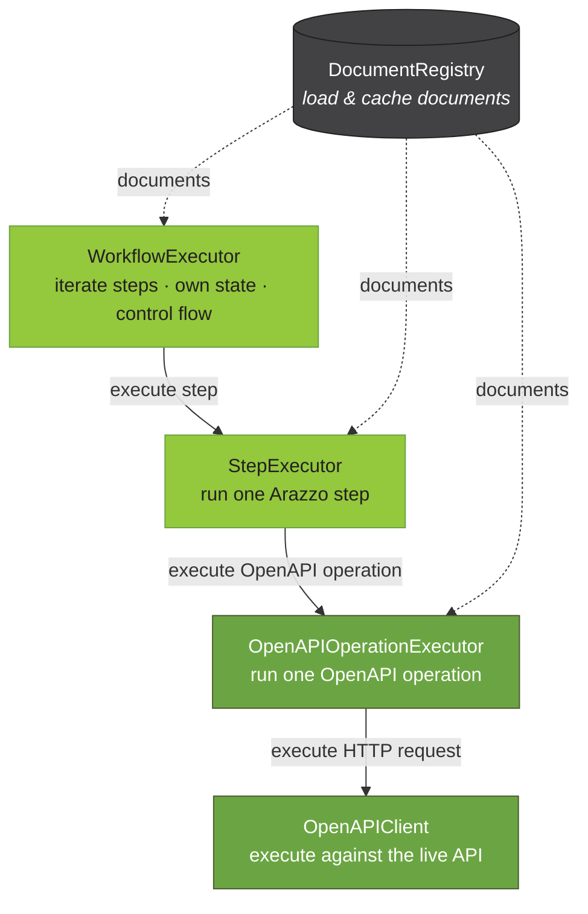

# @jentic/arazzo-runner

> [!WARNING]
> This package is under heavy development. APIs may change without notice.

`@jentic/arazzo-runner` executes [Arazzo Specification](https://spec.openapis.org/arazzo/latest.html) workflows against live APIs described by [OpenAPI Specification](https://spec.openapis.org/oas/latest.html) source descriptions.
It builds on [SpecLynx ApiDOM](https://github.com/speclynx/apidom) data models and reuses the loading, resolution, and normalization primitives shared across [`@jentic/arazzo-parser`](https://www.npmjs.com/package/@jentic/arazzo-parser) and [`@jentic/arazzo-resolver`](https://www.npmjs.com/package/@jentic/arazzo-resolver).

**Supported Arazzo versions:**

- [Arazzo 1.0.0](https://spec.openapis.org/arazzo/v1.0.0)
- [Arazzo 1.0.1](https://spec.openapis.org/arazzo/v1.0.1)

**Supported OpenAPI versions (for source descriptions):**

- [OpenAPI 2.0](https://spec.openapis.org/oas/v2.0)
- [OpenAPI 3.0.x](https://spec.openapis.org/oas/v3.0.4)
- [OpenAPI 3.1.x](https://spec.openapis.org/oas/v3.1.2)

## Installation

> [!NOTE]
> This package is not yet published to npm. It is developed within the [`jentic-arazzo-tools`](https://github.com/jentic/jentic-arazzo-tools) monorepo and will be publicly installable once its API stabilizes.

## Architecture

Running an Arazzo workflow is a pipeline of small, single-responsibility building blocks organized into four main components:

- **`DocumentRegistry`** — loads and caches the Arazzo entry document and its OpenAPI source descriptions, so each is fetched and parsed once.
- **`WorkflowExecutor`** — iterates a workflow's steps, owns the run state, and interprets control-flow actions (`goto`, `retry`, `end`).
- **`StepExecutor`** — runs a single Arazzo step: locates its operation, resolves inputs, evaluates criteria and outputs, and selects the next action.
- **`OpenAPIOperationExecutor`** — runs a single OpenAPI operation and returns its raw response; the Arazzo-agnostic seam between the runner and any `OpenAPIClient`.



Each layer reads run state but never mutates it — the `WorkflowExecutor` is the single writer that records outputs and interprets the returned control-flow action.

## `DocumentRegistry`

Loads and caches Arazzo and OpenAPI documents, so a source description referenced by many steps is fetched and parsed once.

```js
import { DocumentRegistry } from '@jentic/arazzo-runner';

const registry = new DocumentRegistry();

// the entry Arazzo document.
const arazzoDoc = await registry.acquireEntryDocument('https://example.com/workflow.arazzo.yaml');

// a source description, resolved by name to an absolute URI, then acquired.
const uri = arazzoDoc.resolveSourceDescriptionURI('petstoreAPI');
const openapiDoc = await registry.acquire(uri);

registry.clear(); // drop cached documents to reclaim memory
```

## `WorkflowExecutor`

> [!WARNING]  
> Not yet implemented — work in progress. The sections below describe the current building blocks; `WorkflowExecutor` is the next one.

`WorkflowExecutor` will be the stateful orchestrator that runs a whole workflow: it iterates a workflow's steps, calling `StepExecutor` per step, and owns the run state (a `WorkflowExecutionState`) that accumulates each step's outputs so later steps can read `$steps.*.outputs`. It interprets the control-flow actions `StepExecutor` only _selects_ — `goto`, `retry`, and `end` — applies workflow-level defaults (`successActions` / `failureActions`, `parameters`), resolves workflow `inputs` / `outputs`, and calls sub-workflows.

## `StepExecutor`

Executes a single Arazzo step that invokes an OpenAPI operation, returning its outcome. It orchestrates the full per-step pipeline:

1. locate the step's operation (`operationId` or `operationPath`);
2. resolve the step's `parameters` and `requestBody` against the pre-request context (`$inputs`, `$steps.*.outputs`, …);
3. delegate the call to `OpenAPIOperationExecutor`;
4. evaluate `successCriteria`, resolve `outputs`, and select the `onSuccess` / `onFailure` action against the post-request context (`$statusCode`, `$response.*`, `$request.*`, `$url`, `$method`).

`StepExecutor` **reads run state and mutates nothing** — it returns the resolved outputs and the selected action for the caller to record and interpret. A step targeting a `workflowId` (a sub-workflow) is not an operation step and throws; running sub-workflows is a future `WorkflowExecutor`'s concern.

```js
import {
  DocumentRegistry,
  ArazzoWorkflowExtractor,
  ArazzoStepExtractor,
  WorkflowExecutionState,
  StepExecutor,
  OpenAPIClientSwagger,
} from '@jentic/arazzo-runner';

const registry = new DocumentRegistry();
const arazzoDoc = await registry.acquireEntryDocument('https://example.com/workflow.arazzo.yaml');

// pull a step out of the loaded Arazzo document by workflow + step id.
const workflow = new ArazzoWorkflowExtractor().extract(arazzoDoc, 'authenticateAndOrderPet');
const step = new ArazzoStepExtractor().extract(workflow, 'findAvailablePets');

const executor = new StepExecutor({
  document: arazzoDoc,
  registry,
  clientFactory: (document) => new OpenAPIClientSwagger(document),
});

// run state carries $inputs and accumulates $steps.*.outputs across a run.
const state = new WorkflowExecutionState({ inputs: { preferredPetStatus: 'available' } });

const outcome = await executor.execute(step, state, {
  contextUrl: 'https://petstore3.swagger.io',
});

console.log(outcome.successful); // true when every successCriterion passed
console.log(outcome.outputs); // resolved step outputs, keyed by name
console.log(outcome.action); // the selected onSuccess / onFailure action, or undefined

// a caller records the outputs so a later step can read $steps.findAvailablePets.outputs.*
state.setStepOutputs(outcome.stepId, outcome.outputs);
```

### Authoring errors vs. failed steps

The two are deliberately distinct:

- A **received response with unmet criteria** is a normal outcome — `successful: false`, no throw.
- **Malformed input** throws an `ExecutionError` (a step with no operation target, more than one mutually-exclusive target, a `workflowId` step, or an operation that cannot be located).

## `OpenAPIOperationExecutor`

Executes a single OpenAPI operation and returns its raw response. It is **Arazzo-agnostic**: it neither locates the operation nor resolves runtime expressions. Given a canonical locator (`{ document, jsonPointer }`) it extracts the operation from its owning document, normalizes it, assembles a minimal standalone OpenAPI document containing just that operation, builds a client for the assembled document, and executes it.

`OpenAPIOperationExecutor` is the seam between the runner and any OpenAPI client implementation. It builds its client through the injected `clientFactory`, so a different HTTP stack (or a deterministic stub in tests) can be dropped in without touching the runner.

Because it is Arazzo-agnostic, it can be used **standalone** — with only an OpenAPI document and an `operationId`, no Arazzo workflow involved. The operation index on the loaded document maps an `operationId` to its JSON Pointer, which is all a locator needs:

```js
import {
  DocumentRegistry,
  OpenAPIOperationExecutor,
  OpenAPIClientSwagger,
} from '@jentic/arazzo-runner';

const registry = new DocumentRegistry();
const openapiDoc = await registry.acquire('https://petstore3.swagger.io/api/v3/openapi.json');

// build a canonical { document, jsonPointer } locator straight from the OpenAPI
// document — the operation index resolves an operationId to its JSON Pointer.
const locator = {
  document: openapiDoc,
  jsonPointer: openapiDoc.operationIndex.get('findPetsByStatus'),
};

const executor = new OpenAPIOperationExecutor({
  clientFactory: (document) => new OpenAPIClientSwagger(document),
});

const response = await executor.execute(locator, {
  parameters: { status: 'available' },
  contextUrl: 'https://petstore3.swagger.io', // base URL for the operation's relative server
});

console.log(response.status, response.body);
```

A non-2xx response is returned as data, not thrown — whether it counts as success is judged (by a step's `successCriteria`) one level up. Only malformed input (an unlocatable operation, an unsupported OpenAPI version) throws.

## Runtime expressions

Steps reference run state and responses through [Arazzo runtime expressions](https://spec.openapis.org/arazzo/latest.html#runtime-expressions). `RuntimeExpressionEvaluator` resolves them against the current context; the supported roots include `$inputs`, `$outputs`, `$steps.*`, `$workflows.*`, `$statusCode`, `$response.*`, `$request.*`, `$url`, `$method`, `$components.*`, and `$sourceDescriptions.*`. Criteria are evaluated by version-aware evaluators (`simple`, `regex`, `jsonpath`, `xpath`).
